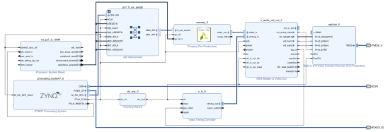

# Conway

This is a simple implementation of Conway's Game of Life on PYNQ-Z1. The game is implemented in C++ and the hardware acceleration is done using Vivado HLS. The game is displayed on HDMI output with a resolution of 1280x720 pixels, 60 frames per second.


## Getting Started

### Prerequisites

First, you need to add pynq-z1 board files to Vivado. Follow the instructions [here](https://pynq.readthedocs.io/en/latest/overlay_design_methodology/board_settings.html#vivado-board-files).

### Clone the repository

```shell
git clone https://github.com/Imiloin/Conway.git
cd Conway
```

### Create Vivado Project

A `tcl` script is provided to create the Vivado project. Run the following command **in Vivado Tcl Console** to create the project.

```tcl
cd /path/to/Conway
source vivado_project.tcl
```

> [!WARNING]
> The script is only tested on Vivado 2018.3. It may not work on other versions.

If the script runs successfully, a new Vivado project will pop up and the block design will be created automatically. The block design should look like this:



In case the block design is not created automatically, below is some configuration that needs to be done manually:

* `FCLK_CLK0` of the `ZYNQ7 Processing System` is set to 100 MHz.
* The `Video Timing Controller` IP is set to run at 720p video mode.
* The `Clocking Wizard` IP is set to generate a 74.25 MHz clock for 720p 60Hz video output.
* TMDS clock range of the `RGB to DVI Video Encoder` IP is set to `<80MHz (720p)`.

### Generate Bitstream

After the block design is created, generate the bitstream by clicking on `Generate Bitstream` in the Flow Navigator.

When the bit generation is completed, a selection box will be displayed with Open Implemented Design option selected. Click Cancel.

### Export Hardware

Export the hardware by clicking on `File -> Export -> Export Hardware`. Make sure that the `Include bitstream` option is checked.

### Launch SDK

After exporting the hardware, launch SDK by clicking on `File -> Launch SDK`.

In SDK, create a new application project by clicking on `File -> New -> Application Project`. Name the project `conway`, click Next, and select `Empty Application` and click Finish.

Select `conway` in the project view, right-click the src folder, and select Import. Expand General category and double-click on File System. Browse to the `/path/to/Conway/src/software` folder and import `main.c`.

### Run the Application

Connect the PYNQ-Z1 board to the computer and program the FPGA by clicking on `Xilinx -> Program FPGA`. Make sure the HDMI output is connected to a monitor.

It is time to run the application! Right-click on the `conway` project and select `Run As -> Launch on Hardware (System Debugger)`. The game should be displayed on the monitor, running at 60 frames per second.

## Custom IP

The game logic is packaged as a custom IP in Vivado HLS. The IP source code can be accessed in the `src/hls` folder. You can play around with the IP by modifying the source code and re-synthesizing it using Vivado HLS.

## Acknowledgments

Some parts of the code are generated by  Google Gemini.
